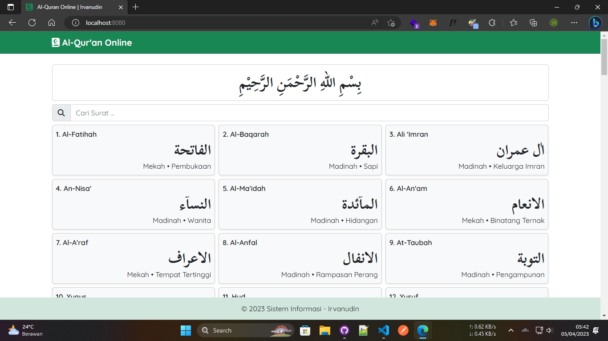
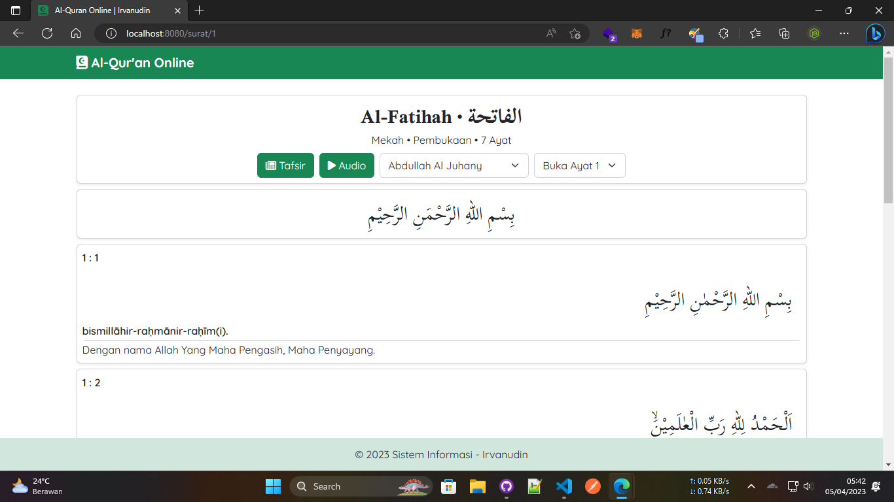
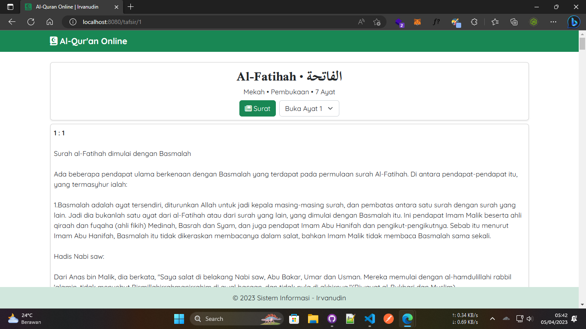

# 📆 JADWAl SHOLAT & IMSAKIYAH RAMADHAN 2023

Aplikasi Al-Qur'an Online sebagai UTS kuliah S1 Sistem Informasi ITBA DCC Pringsewu 2022 dengan Bahasa Pemrograman Java dan Framework Spring Boot + Thymeleaf.

Home

Surat

Tafsir

---

Requested by my friend (Irvanudin)

© 2023 Bagus Pangestu - <baguspangestu@yandex.com>
